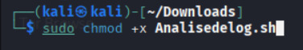
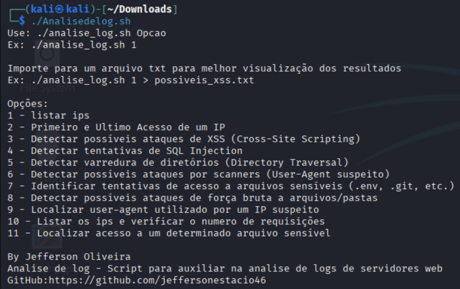

**Analise-de-log-teste**

**Script em shell para analise de logs**

Para instalar o Shellscript, instale usando o codigo a baixo:
>`sudo chmod +x Analisedelog.sh`

Depois basta executar o codigo com o comando a baixo:
>`./Analisedelog.sh`
E esse menu que vai aparecer, para verificar todas as analises disponiveis
>

